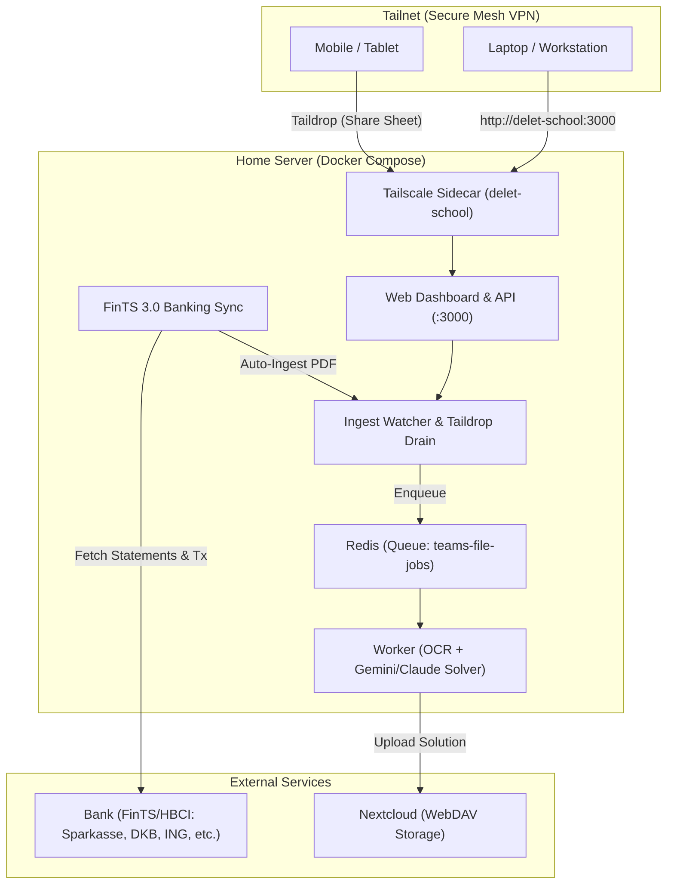

# Home Server Deployment & Tailnet Banking Guide

This guide walks through deploying the automated pipeline on a home server (e.g. Raspberry Pi 5, Intel NUC, Proxmox VM, or home NAS) and accessing it securely from anywhere over your Tailscale tailnet.

---

## 1. System Architecture



All containers share the `tailscale` sidecar's network namespace (`network_mode: "service:tailscale"`). This means:
- The Web Dashboard is bound directly to your tailnet hostname at `http://delet-school:3000`.
- Only devices authenticated to your private Tailscale network can reach the dashboard and upload files.
- No public router ports or port forwarding needed.

---

## 2. Remote Access over Tailscale

### Option A: Direct MagicDNS (Default)
When Tailscale is running, open any browser on any device logged into your tailnet:
```
http://delet-school:3000
```
*(If you changed `TS_HOSTNAME` in `.env`, use `http://<your-hostname>:3000`)*

### Option B: Automatic HTTPS via Tailscale Serve
To enable seamless HTTPS with Let's Encrypt certificates managed automatically by Tailscale:
1. Enable HTTPS in your [Tailscale Admin Console](https://login.tailscale.com/admin/dns).
2. In your `.env` file, set:
   ```env
   TS_SERVE=true
   ```
3. Restart the containers:
   ```bash
   docker compose up -d
   ```
4. Access securely at:
   ```
   https://delet-school.<your-tailnet-name>.ts.net
   ```

### Option C: Taildrop (Direct File Sharing)
From iOS, Android, macOS, or Windows:
1. Open any document or PDF in your file manager.
2. Tap **Share** &rarr; **Tailscale (Taildrop)** &rarr; select **`delet-school`**.
3. The file is sent over your encrypted mesh network, picked up by the background drainer, and automatically processed by the pipeline.

---

## 3. Banking Integration (FinTS 3.0 / HBCI)

The system connects directly to German and European banks supporting FinTS 3.0 / HBCI to fetch account balances, transactions, and electronic PDF account statements (`Kontoauszüge`).

### Supported Banks & Bank Codes (BLZ)
| Bank | BLZ | Standard Endpoint URL |
| :--- | :--- | :--- |
| **DKB (Deutsche Kreditbank)** | `12030000` | `https://banking.dkb.de/fints/service` |
| **ING (ING-DiBa)** | `50010517` | `https://hbci-pintan.ing.de/cgi-bin/hbci-pintan` |
| **Commerzbank** | `37020500` | `https://fints.commerzbank.de/fints` |
| **Sparkasse** | *Check bank card* | *Usually resolved automatically or via bank URL* |
| **Volksbanken / Raiffeisenbanken** | *Check bank card* | `https://fints1.atruvia.de/cgi-bin/hbciservlet` |
| **HypoVereinsbank (UniCredit)** | `70020270` | `https://hbci11.hypovereinsbank.de/bank/hbci` |

### Configuration in `.env`
```env
# FinTS Banking Credentials
FINTS_BLZ=12030000
FINTS_USER=your_login_id_or_account_number
FINTS_PIN=your_online_banking_pin

# Optional: target a specific IBAN if you have multiple accounts
FINTS_IBAN=DE8912030000XXXXXXXXXX

# Optional: preferred TAN method (e.g. pushTAN, photoTAN, SMS)
FINTS_TAN_MEDIUM=pushTAN

# Auto-sync interval (in hours, e.g. every 24 hours). 0 disables auto-sync.
FINTS_AUTO_SYNC_INTERVAL_HOURS=24

# Automatically route downloaded statement PDFs to the pipeline for OCR & filing
FINTS_AUTO_INGEST_STATEMENTS=true
```

### 2FA / TAN Challenge Handling
European PSD2 regulations require occasional Strong Customer Authentication (SCA / 2FA):
- When the bank issues a TAN challenge, the Web Dashboard displays an alert banner.
- **App Approval (pushTAN / photoTAN)**: Open your banking app, approve the login prompt, and click **"✓ I Approved in Banking App"** on the dashboard.
- **Code Entry (SMS-TAN / chipTAN)**: Enter the 6-digit code into the prompt box and click **"Submit TAN"**.
- The sync continues automatically and pulls your latest statements and transactions.

---

## 4. Step-by-Step Home Server Setup

### Step 1: Clone and Configure Environment
On your home server:
```bash
git clone <repo-url> /opt/delet-school
cd /opt/delet-school
cp .env.example .env
```

Edit `.env` with your preferred editor:
```bash
nano .env
```

Required settings:
1. **`TS_AUTHKEY`**: Create an auth key in the [Tailscale Admin Console](https://login.tailscale.com/admin/settings/keys). Recommended: OAuth Client with tag `tag:delet-school`.
2. **`NEXTCLOUD_URL`**, **`NEXTCLOUD_USERNAME`**, **`NEXTCLOUD_APP_PASSWORD`**: For WebDAV archival of solutions and bank statements.
3. **`FINTS_BLZ`**, **`FINTS_USER`**, **`FINTS_PIN`**: Your banking credentials.

### Step 2: Build & Start Containers
```bash
docker compose up -d --build
```

### Step 3: Check Container Status
```bash
docker compose ps
docker compose logs -f tailscale
```

Once `tailscale` reports `service_healthy`, the Web Dashboard, Ingest, Redis, and Worker will be running and reachable over your tailnet.

---

## 5. Web Dashboard Features

Visit `http://delet-school:3000`:

1. **📊 Overview**:
   - Total account balance in EUR and last sync time.
   - Pending jobs in the pipeline.
   - Bank statement count and processed documents count.
   - Recent transaction feed.
2. **🏦 Banking (FinTS)**:
   - Live balance cards for all linked bank accounts (Girokonto, Tagesgeld, Sparbuch).
   - "Sync Accounts & Statements" button.
   - Interactive TAN prompt for 2FA approvals.
   - Searchable transaction history with credit/debit color coding.
   - Electronic PDF account statement downloads (`Kontoauszüge`).
3. **📤 Dropzone**:
   - Direct in-browser file upload from anywhere on your tailnet (iOS/Android browser, laptop, tablet).
   - Automatically enqueues uploaded documents into BullMQ.
4. **⚡ Pipeline Jobs**:
   - Live queue monitor showing job state (`waiting`, `active`, `completed`, `failed`).
5. **📁 Processed Documents**:
   - Browse files resolved and stored to Nextcloud.

---

## 6. Maintenance & Useful Commands

| Task | Command |
| :--- | :--- |
| View live logs | `docker compose logs -f web worker` |
| Trigger manual banking sync | Click **"Sync Bank Now"** in UI or `curl -X POST http://delet-school:3000/api/banking/sync` |
| Restart all services | `docker compose restart` |
| Update and rebuild | `git pull && docker compose up -d --build` |
| View Tailscale status | `docker compose exec tailscale tailscale status` |
